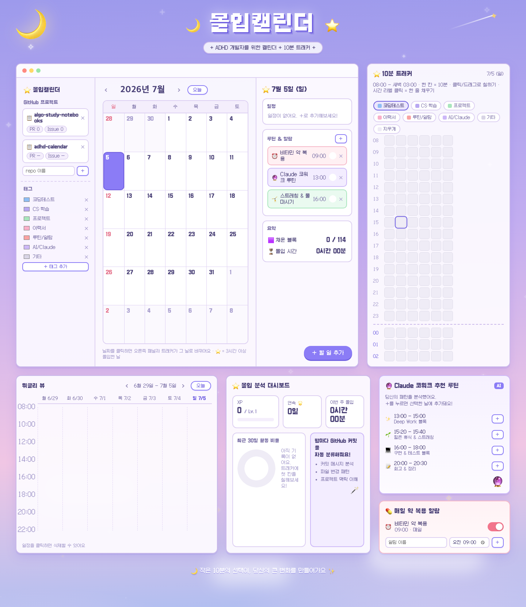

# Focus Calendar (몰입캘린더)

ADHD 개발자를 위한 몰입 관리 캘린더. 몽환 파스텔 픽셀아트 스타일의 정적 웹앱으로, "얼마나 계획대로 했나"가 아니라 **"실제로 몇 분 몰입했는지"를 눈으로 확인**하는 것이 목표입니다.



## 시작하기

빌드 없음. 브라우저에서 바로 엽니다:

```bash
open index.html        # 동작하는 앱 (localStorage 저장)
open manual.html       # 플레이어 매뉴얼 (사용설명서)
open design-preview.html  # 디자인 쇼케이스 목업
```

## 주요 기능

- **먼슬리 뷰** — 날짜 셀에 태그 색 점(dot)으로 밀도를 한눈에 파악. 날짜 클릭 시 상세 드릴다운.
- **위클리 뷰** — 시간축 그리드로 하루 흐름 확인.
- **10분 타임 트래커** (핵심 기능) — 하루(08:00~새벽 3:00)를 10분 칸으로 쪼갠 그리드. 칸을 클릭하면 태그 색이 순환(업무 → 운동 → 딥워크 → 학습 → 비우기)하고, 기록한 블록 수와 누적 몰입 시간이 실시간 갱신됩니다.
- **루틴 & 알람** — 색으로 종류를 구분하며 이 규칙은 앱 전체에서 고정:
  - 코럴 핑크 = 약 복용 등 매일 챙겨야 하는 알람
  - 라벤더 = Claude 코워크가 모아준 AI 추천 루틴
  - 민트 = 스트레칭 등 일반 습관
- **GitHub 자동화 & XP 시스템** — 커밋/로컬 활동을 감지해 경험치와 스트릭 부여.

## GitHub 트래커 (`scripts/track_progress.py`)

`gh` CLI 로그인(`gh auth status`)이 전제이며, launchd로 매일 밤 22:00 자동 실행됩니다.

```bash
python3 scripts/track_progress.py          # 수동 실행
python3 scripts/track_progress.py --reset  # 과거 기록 소급 없이 처음부터
```

| 카테고리 | 감지 대상 | XP |
|---|---|---|
| 코딩테스트 | `algo-study-notebooks`, `LeetCode`, `coding-test` 리포 커밋 | 커밋당 +10 |
| CS/학습 | llm 관련 실습 리포 커밋 | 기록만 |
| 프로젝트 | 그 외 앱/프로젝트 리포 커밋 | 기록만 |
| 이력서 작성 | `~/Documents/job_prep` 폴더 파일 변경 | 기록만 |

- 레벨: `floor(XP / 100) + 1` — 100XP마다 레벨업
- 스트릭: 코딩테스트 커밋을 매일 하면 연속일 증가, 하루 거르면 1로 리셋 (백준 스트릭 규칙)
- 최근 30일 카테고리별 균형(%)도 함께 출력 — 한 분야만 파고 있진 않은지 확인용
- 결과는 `data.json`에 저장, 실행 로그는 `logs/`에 기록

## 프로젝트 구조

```
index.html           # 동작하는 앱 (vanilla JS + localStorage)
manual.html          # 사용설명서
design-preview.html  # 디자인 쇼케이스
design-tokens.json   # 디자인 토큰 (v0.2)
DESIGN.md            # 디자인 시스템 문서 및 의사결정 기록
data.json            # XP/스트릭/활동 히스토리 (트래커가 생성)
scripts/             # track_progress.py + 테스트
logs/                # launchd 실행 로그
```

## 디자인

라벤더→핑크 밤하늘 그라디언트 + 픽셀 별/달, Galmuri11·DungGeunMo 픽셀 폰트. "해야 할 일 목록"이 아니라 "매일 돌아오고 싶은 공간"을 지향합니다. 색상 규칙, ADHD 친화 원칙 등 상세한 근거는 [DESIGN.md](DESIGN.md) 참고.
